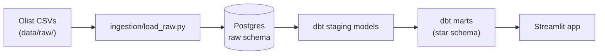
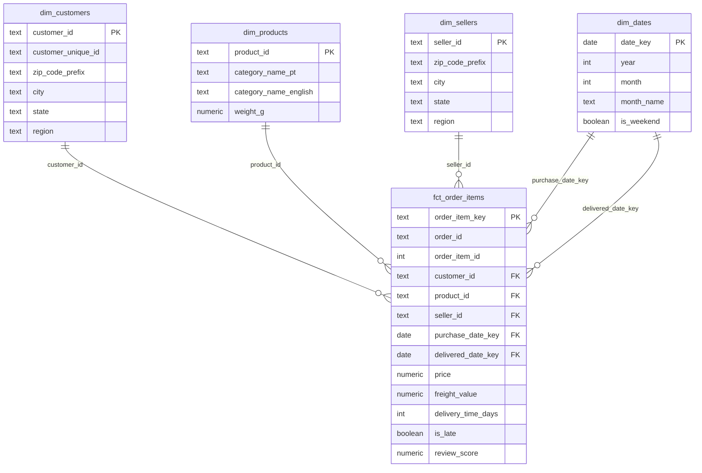
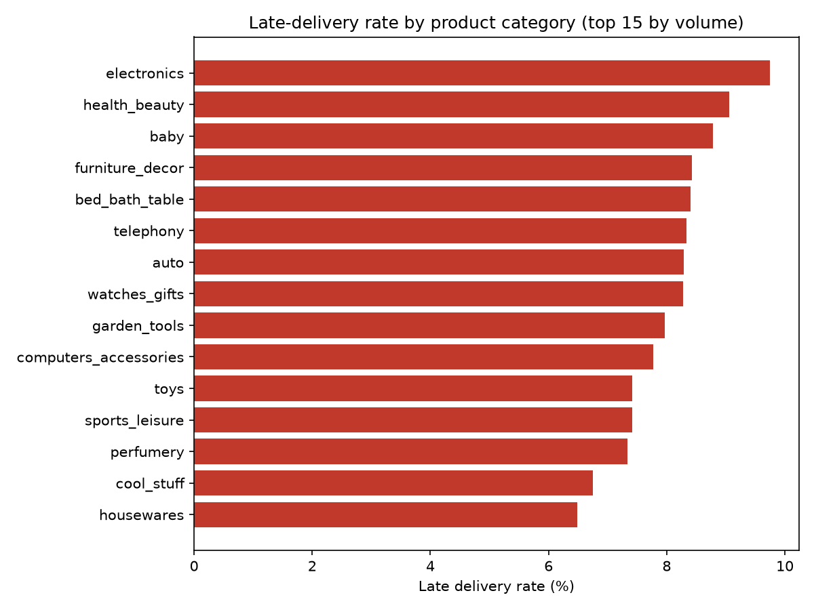
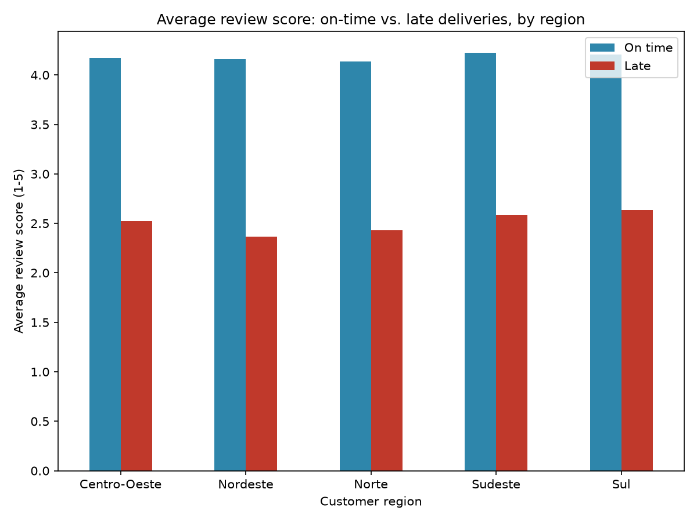

# E-commerce ELT & Analytics Pipeline

## Business problem

An e-commerce operation is losing revenue and reputation to late deliveries,
and its sales data is fragmented across many source tables, making it hard
to answer basic operational questions reliably.

This pipeline consolidates that fragmented data into a trustworthy, tested
model, and then answers: **how do delivery delays affect customer review
scores, broken down by product category and region?**

## Architecture





## Data model

Grain of the fact table is **one row per order item**.

| Model              | Type      | Grain / notes                                                        |
|---------------------|-----------|-----------------------------------------------------------------------|
| `fct_order_items`   | Fact      | One row per order item. Measures: price, freight, delivery time (days), is_late flag, review score. |
| `dim_customers`     | Dimension | One row per customer, including state/region.                        |
| `dim_products`      | Dimension | One row per product, including the English category name.            |
| `dim_sellers`       | Dimension | One row per seller, including state/region.                          |
| `dim_dates`         | Dimension | One row per calendar date used by the fact (purchase, delivery).      |

A star schema was chosen because the goal is fast, simple aggregation for a
handful of known BI questions (late-delivery rate, average review score, by
category/region) — a small number of wide dimensions joined to one fact
table is exactly what that read pattern wants, with far less join
complexity than a fully normalized model.

## Data quality

Tests run on every model, documented in each `schema.yml`:

- **`not_null` + `unique`** on every dimension's primary key and the fact's
  surrogate key — protects against duplicate or missing keys silently
  corrupting joins or double-counting metrics.
- **`relationships`** from every `fct_order_items` foreign key to its
  dimension — protects against orphaned fact rows that would disappear
  from (or break) any join-based report.
- **`accepted_values`** on `order_status` — catches an unexpected or new
  status value the pipeline wasn't built to handle.
- **Singular tests** — delivered date is never before purchase date; price
  and freight are never negative. Catches impossible business-logic
  violations that generic tests can't express.

All of the above run automatically in CI (`.github/workflows/ci.yml`) on
every push, against a small sample of the real dataset, and the build fails
if any test fails.

## Data governance

Customer identifiers are salted and hashed in staging before any downstream
model can see them, and location data in the marts stops at
zip/city/state/region — the precise lat-long geolocation table is
deduplicated but never joined into anything queryable. Full details,
including what a production access-control setup would need, are in
[`docs/governance.md`](docs/governance.md).

## Why a star schema and not a Data Vault?

Data Vault favors auditability and agile ingestion from many changing
source systems — useful when the source landscape itself is in flux. Here,
the source is a fixed, already-clean CSV export and the goal is read/BI
consumption for a handful of known questions, which is exactly what a star
schema optimizes for.

## How to run

Prerequisites: Docker, Python 3.11+.

```bash
git clone <this-repo> && cd ecommerce-elt-pipeline
cp .env.example .env

python3 -m venv .venv && source .venv/bin/activate
pip install -r requirements.txt

docker compose up -d

# Download the Olist Brazilian E-Commerce dataset from Kaggle
# (olistbr/brazilian-ecommerce) and place the 9 CSVs in data/raw/
python ingestion/load_raw.py

export DBT_PROFILES_DIR=$(pwd)/dbt/ecommerce
cd dbt/ecommerce && dbt build && cd ../..

streamlit run app/streamlit_app.py
```

`dbt docs generate` (run from `dbt/ecommerce/`) builds a browsable data
dictionary from the `description:` fields in every `schema.yml`.

## Results

Analyzed 110,196 delivered order items from the full Olist dataset.

**Late-delivery rate by product category** — ranges from ~6.5%
(housewares) to ~9.7% (electronics); no category is dramatically worse
than the rest, so delay risk is fairly evenly spread across the catalog.



**Review score vs. delivery delay, by region** — this is the sharper
finding: a late delivery drops the average review score from **~4.1-4.2**
(on time) to **~2.4-2.6** (late) in *every* region, a consistent ~1.6-point
drop regardless of where the customer is.



**Answer to the business question:** delivery delay is a far stronger
predictor of a bad review than product category or customer region —
category only spreads late-rate by about 3 points, but being late at all
costs almost 2 full stars off the average review, uniformly across every
region in Brazil.
